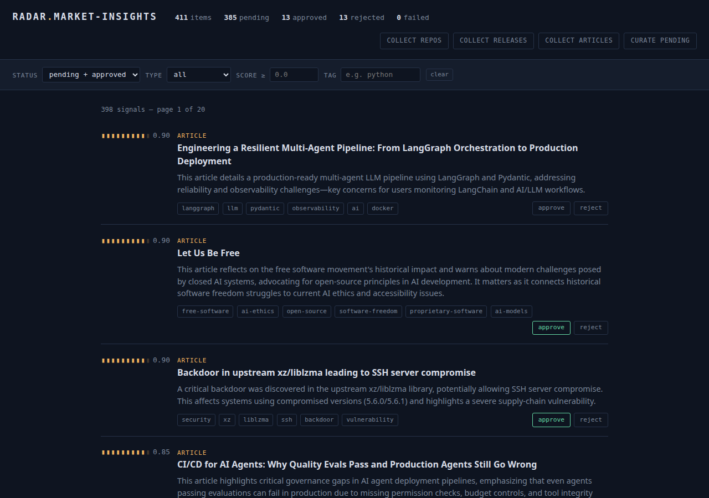

# market-insights-service

A standalone FastAPI microservice that aggregates software-development market
signals — trending GitHub repositories, PyPI/npm library releases, and technical
articles — stores them in PostgreSQL, and curates them with a local LLM against a
configurable technical profile. Built to mirror the **pissync** microservice
conventions (uv, async SQLAlchemy 2.0, Celery + RedBeat on Redis, single-stage uv
Docker image) so it can later drop into that network unchanged.

> **Full docs:** see [`docs/`](docs/README.md) — architecture, the collection →
> curation → review flows, API reference, data model, configuration, and ops.

## What it does

| Collector (Celery beat) | Source | Cadence |
|---|---|---|
| `collect_trending` | GitHub Search API | every 6h |
| `collect_releases` | PyPI + npm registries | daily 12:00 |
| `collect_articles` | Dev.to API + Hacker News (Algolia) + Medium tag RSS | every 12h |
| `curate_uncurated` | Ollama LLM summary/tags + local ranker score | chained after each collection + daily 02:00 sweep |
| `rerank_all` | Local ranker only (no LLM) — re-scores the feed against your latest verdicts | every 30 min |

Every collected row carries a unique `dedup_key`; collectors upsert with
`INSERT … ON CONFLICT DO NOTHING`, so re-runs are idempotent. Curation is also
idempotent — an item is curated at most once (`(item_type, item_id)` unique).
Articles additionally pass an age gate (`ARTICLE_MAX_AGE_DAYS`) and a
title-fingerprint collapse, so old news and cross-source duplicates never enter
the pipeline.

Consume the result at **`GET /`** (single-page review UI: ranked feed, filters,
approve/reject) or **`GET /api/feed`** (same data over JSON, default
pending + approved).

Approving and rejecting is not just bookkeeping — it *is* the ranking. A local
decision model scores each item by how you judged its nearest reviewed neighbours,
`GET /api/curation/calibration` reports whether the scores are tracking those
decisions, and `GET /api/config/keyword-suggestions` mines approved items' tags for
search terms worth adding to the profile. See
[docs/flows.md](docs/flows.md) for the guards on that loop.

## Review UI

One self-contained page (`src/static/index.html`, no build step) served at
<http://localhost:8003/>:



- **Ranked feed** across repos, releases, and articles — the segment gauge and
  score reflect the ranker's `importance_score` — learned from your approve/reject verdicts.
- **Filters** for status, item type, minimum score, and tag (click any tag to
  filter by it).
- **One-click review** (`approve` / `reject`) and live stats per status, including
  `separation` — how much higher the model scored what you kept than what you dropped.
- **Suggested keywords** mined from your approvals, for adding to the profile.
- **Run collectors on demand** from the header — no shell needed.

## Quick start (Docker)

```bash
cp .env.example .env        # set GITHUB_TOKEN; point OLLAMA_BASE_URL at your daemon
docker compose up --build   # api :8003, postgres, redis, celery (worker + embedded beat)
```

The API container migrates on boot. Review UI at http://localhost:8003/ —
Swagger at http://localhost:8003/docs.

Fire a collector by hand — over HTTP (no shell into the container needed):

```bash
# list what can be triggered (short name → full Celery name)
curl http://localhost:8003/api/tasks

# enqueue one now instead of waiting for beat → 202 + Celery task id
curl -X POST http://localhost:8003/api/tasks/collect_trending/trigger
# {"task": "src.tasks.github_tasks.collect_trending", "task_id": "…", "state": "queued"}

# then watch it land
curl http://localhost:8003/status
```

Triggerable: `collect_trending`, `collect_releases`, `collect_articles`,
`curate_uncurated`, `recurate_all`. Or via the Makefile if you have a shell
on the box:

```bash
make trigger t=src.tasks.github_tasks.collect_trending
```

## Quick start (local)

```bash
uv sync                     # installs into .venv (Python 3.13)
uv run uvicorn src.main:app --reload --port 8003
```

Requires a reachable Postgres + Redis (`DATABASE_URL`, `REDIS_URL`, `CELERY_*`).

## Configuration

All settings live in `src/core/conf.py` (pydantic-settings, read from `.env`).
Key vars: `DATABASE_URL`, `REDIS_URL`, `CELERY_BROKER_URL`/`CELERY_RESULT_BACKEND`,
`GITHUB_TOKEN`, `OLLAMA_BASE_URL`/`OLLAMA_MODEL`. The *what to
search for* (stacks, keywords, monitored libraries, source toggles) is stored in
the database and edited via `PUT /api/config/preferences` + `POST /api/config/sources`.

## Endpoints

`GET /` (review UI); `GET /health`, `GET /status`; `/api/feed` (ranked unified
feed with `status`/`item_type`/`min_score`/`tag`/`since` filters) and
`/api/feed/digest` (the last N days as JSON or Markdown);
`/api/repositories` (list/detail/`POST search`); `/api/libraries`
(list/detail-history/add/remove); `/api/articles` (list/detail/`search`);
`/api/curation` (list/`stats`/`calibration`/`PUT {id}/review`/bulk review); `/api/tasks`
(list/`POST {name}/trigger`); `/api/config/preferences` + `/api/config/sources` +
`/api/config/keyword-suggestions`. Full schemas at `/docs`.

A few more examples:

```bash
# newest curated repositories, page 2
curl "http://localhost:8003/api/repositories?page=2&per_page=20"

# ad-hoc repo search (POST body, not a saved preference)
curl -X POST http://localhost:8003/api/repositories/search \
  -H 'content-type: application/json' \
  -d '{"languages": ["rust"], "keywords": ["cli"], "min_stars": 500, "max_results": 25}'

# start monitoring a library
curl -X POST http://localhost:8003/api/libraries \
  -H 'content-type: application/json' \
  -d '{"ecosystem": "pypi", "name": "httpx"}'

# approve a curated item
curl -X PUT http://localhost:8003/api/curation/42/review \
  -H 'content-type: application/json' \
  -d '{"status": "approved"}'

# is the score actually tracking your decisions? (watch `separation` grow)
curl http://localhost:8003/api/curation/calibration

# search terms your approvals suggest but the profile is missing
curl http://localhost:8003/api/config/keyword-suggestions

# change what the collectors look for
curl -X PUT http://localhost:8003/api/config/preferences \
  -H 'content-type: application/json' \
  -d '{"stacks": ["python", "rust"], "keywords": ["llm", "async"]}'

# the week in Markdown — paste it into a newsletter or a note
curl "http://localhost:8003/api/feed/digest?days=7&min_score=0.6&format=markdown"
```

## Security

The API is **unauthenticated by design** — it is meant to run inside a private
stack (localhost or a trusted network), like the pissync services it mirrors.
Anyone who can reach the port can trigger collectors and edit the profile, so do
not expose port 8003 to the internet; put it behind your own gateway or VPN if it
needs to travel. `GITHUB_TOKEN` lives in `.env`, which is gitignored — only
`.env.example` is tracked.

## Testing

```bash
uv run pytest tests/unit              # no DB — collectors + curation agent (httpx mocked)
uv run pytest tests/integration       # needs Postgres (TEST_DATABASE_URL)
uv run pytest --cov=src               # everything + coverage
```

## Tech stack

FastAPI · async SQLAlchemy 2.0 + PostgreSQL · Alembic · Celery + celery-redbeat on
Redis · httpx · Ollama (LLM) · uv · Docker · pytest + respx · ruff.

## License

[MIT](LICENSE).
